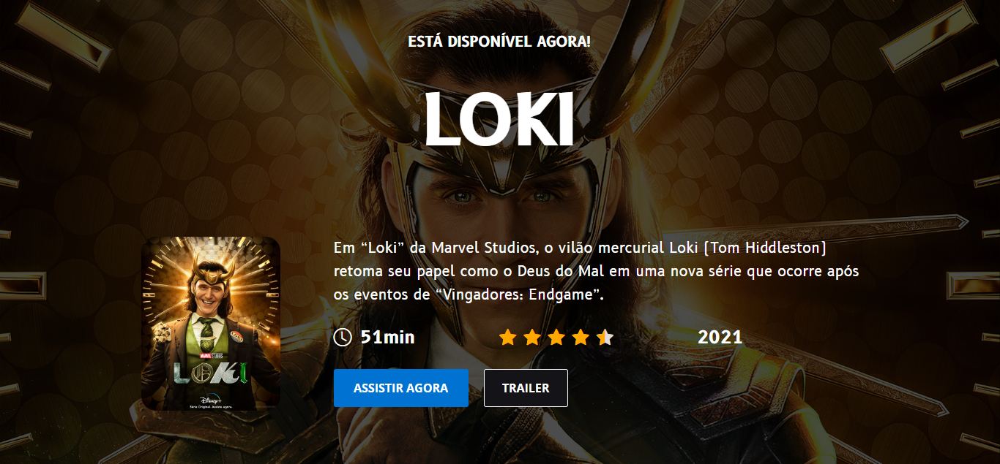

# Desafio 06 da comunidade Codelândia no Discord

## 💻 _loki_

Repositório criado para armazenar o desafio 06 proposto por Iuri Silva criador da comunidade Codelândia no Discord.

## 💻  Projeto desenvolvido
<a href="https://gabrieldiasdev.github.io/loki/" target="_blank">Acesse o projeto</a>

## 💡  Info

O projeto contém uma interface moderna e responsiva para apresentar informações sobre a série Loki, possui também uma funcionalidade de avaliar a série com estrelas, que ficarão salvas por meio do localStorage !

## 👨‍💻 Autor

Gabriel Dias Catarin, desenvolvedor front-end | Bauru, São Paulo

[ LinkedIn](https://www.linkedin.com/in/gabriel-dias-260857207/)
&nbsp;